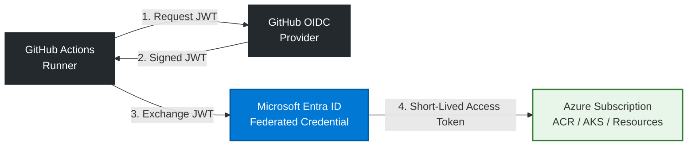

# SignalForge CI System: Architecture & Security Controls

This directory contains the decoupled, parallelized GitHub Actions CI engine for the SignalForge ecosystem. The entire pipeline architecture shifts left on security and runtime efficiency, adhering strictly to Zero-Trust cloud paradigms.

## 1. Passwordless Authentication via Azure Federated OIDC

To completely eliminate the risk of long-lived, static secret exposure (such as Azure Service Principal Client Secrets), authentication to Microsoft Azure is executed using **OpenID Connect (OIDC) Federated Workload Identities**. 

### Cryptographic Identity Exchange Workflow

