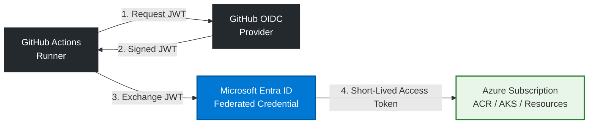

# SignalForge CI System: Architecture & Security Controls

This directory contains the decoupled, parallelized GitHub Actions CI engine for the SignalForge ecosystem. The entire pipeline architecture shifts left on security and runtime efficiency, adhering strictly to Zero-Trust cloud paradigms.

## Passwordless Authentication via Azure Federated OIDC

To completely eliminate the risk of long-lived, static secret exposure (such as Azure Service Principal Client Secrets), authentication to Microsoft Azure is executed using **OpenID Connect (OIDC) Federated Workload Identities**. 

### Cryptographic Identity Exchange Workflow

# Execution Mechanics  

## OIDC Token Issuance: 
The runner requests a cryptographically signed JSON Web Token (JWT) directly from GitHub's Security Token Service (STS), proving the precise repository, branch, and runtime context.

## Federated Validation: 
The token is forwarded to Microsoft Entra ID, which cross-references the token's claims against our pre-configured infrastructure trust relationships.

## Short-Lived Authorization: 
Upon validation, Entra ID mints a scoped, ephemeral OAuth2 access token valid for exactly 60 minutes. **No static credentials touch disk, runner state memory, or logs.**

## Dynamic Component Isolation (Cost Optimization)

*To optimize compute consumption and minimize GitHub Enterprise runner bills, this pipeline implements Asynchronous Path-Filtering Gates.

## The Problem: 
Standard monorepos/multi-service repos suffer from **"Ghost Matrix Runs"**—where editing a single frontend asset triggers heavy compilation, linting, and scanning jobs across every single backend microservice.

## The Solution: 
An upstream inspect_changes job calculates the precise structural delta of each git commit. Using fromJson() deserialization, it dynamically feeds a custom, downscaled array directly into the worker matrix runner.

## Impact: 
**Reduces unnecessary compute runtime overhead by up to 80%,** flattening development queues and lowering cloud infrastructure costs.

## Application SAST, Supply Chain Security & Attestation

This architecture implements a strict multi-layered security verification sequence before code artifacts ever reach production. 

### A. Static Application Security Testing (SAST) via SonarQube
In **Stage 1**, running parallel to the integration tests, a dedicated **SonarQube Analysis Gate** intercepts the developer's source code. 
* By enforcing full git history checkout (`fetch-depth: 0`), the runner scans for code smells, technical debt, and zero-day source-level vulnerabilities (such as SQL injections, XSS vulnerabilities, or hardcoded API credentials) directly on the active commit delta.
* Pull requests are automatically blocked if they fail to meet the required code quality and security thresholds.

### B. Container Image Vulnerability Scanning via Trivy
Once the microservice images are compiled inside the Docker Buildx daemon, they drop into **Stage 2** for an infrastructure layer check. The pipeline triggers an automated **Trivy Diagnostics Scan** to catch operating system vulnerabilities and malicious open-source packages.

> [!IMPORTANT]
> **Supply Chain Hardening:** Adhering to the recent CISA and NIST advisories regarding the *TeamPCP supply chain compromises (CVE-2026-33634)*, all downstream GitHub Actions—including the Trivy scanner itself—are pinned to **absolute, immutable cryptographic git commit SHAs** rather than mutable release tags. This eliminates the risk of upstream tag-poisoning and credential-harvesting exploits.

### C. Cryptographic Provenance and SBOM Generation
Upon completing all validation sequences, clean images are pushed to the **Azure Container Registry (ACR)** accompanied by:
1. **An Automated Software Bill of Materials (SBOM):** A machine-readable, nested inventory detailing every single dependency inside the container.
2. **In-Toto Provenance Attestations:** A cryptographically signed digital footprint proving exactly *where, when, and how* the container was built.

**The Business Impact:** This creates an unbreakable chain of custody. Downstream **Argo CD** engine loops and **Azure Kubernetes Service (AKS)** admission controllers evaluate these signatures at runtime, rejecting unauthorized, unsigned third-party container injections instantly.