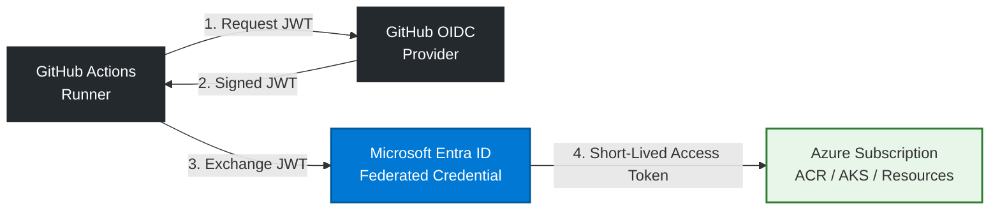

# SignalForge CI System: Architecture & Security Controls

This directory contains the decoupled, parallelized GitHub Actions CI engine for the SignalForge ecosystem. The entire pipeline architecture shifts left on security and runtime efficiency, adhering strictly to Zero-Trust cloud paradigms.

## Passwordless Authentication via Azure Federated OIDC

To completely eliminate the risk of long-lived, static secret exposure (such as Azure Service Principal Client Secrets), authentication to Microsoft Azure is executed using **OpenID Connect (OIDC) Federated Workload Identities**. 

### Cryptographic Identity Exchange Workflow

# Execution Mechanics  

## OIDC Token Issuance: 
The runner requests a cryptographically signed JSON Web Token (JWT) directly from GitHub's Security Token Service (STS), proving the precise repository, branch, and runtime context.

## Federated Validation: 
The token is forwarded to Microsoft Entra ID, which cross-references the token's claims against our pre-configured infrastructure trust relationships.

## Short-Lived Authorization: 
Upon validation, Entra ID mints a scoped, ephemeral OAuth2 access token valid for exactly 60 minutes. **No static credentials touch disk, runner state memory, or logs.**

## Dynamic Component Isolation (Cost Optimization)

*To optimize compute consumption and minimize GitHub Enterprise runner bills, this pipeline implements Asynchronous Path-Filtering Gates.

## The Problem: 
Standard monorepos/multi-service repos suffer from **"Ghost Matrix Runs"**—where editing a single frontend asset triggers heavy compilation, linting, and scanning jobs across every single backend microservice.

## The Solution: 
An upstream inspect_changes job calculates the precise structural delta of each git commit. Using fromJson() deserialization, it dynamically feeds a custom, downscaled array directly into the worker matrix runner.

## Impact: 
**Reduces unnecessary compute runtime overhead by up to 80%,** flattening development queues and lowering cloud infrastructure costs.

# Supply Chain Security & Attestation

Every compiled image pushed to the Azure Container Registry (ACR) undergoes local Trivy Vulnerability Scans pinned to a verified immutable commit SHA to protect the build environment.

Upon passing, images are bundled with an automated **Software Bill of Materials (SBOM)** and Provenance Attestations directly into the build execution payload. This provides our downstream Argo CD and Azure Kubernetes Service (AKS) admission controllers an unbreakable cryptographic receipt verifying the image originated cleanly from this exact workflow tree.