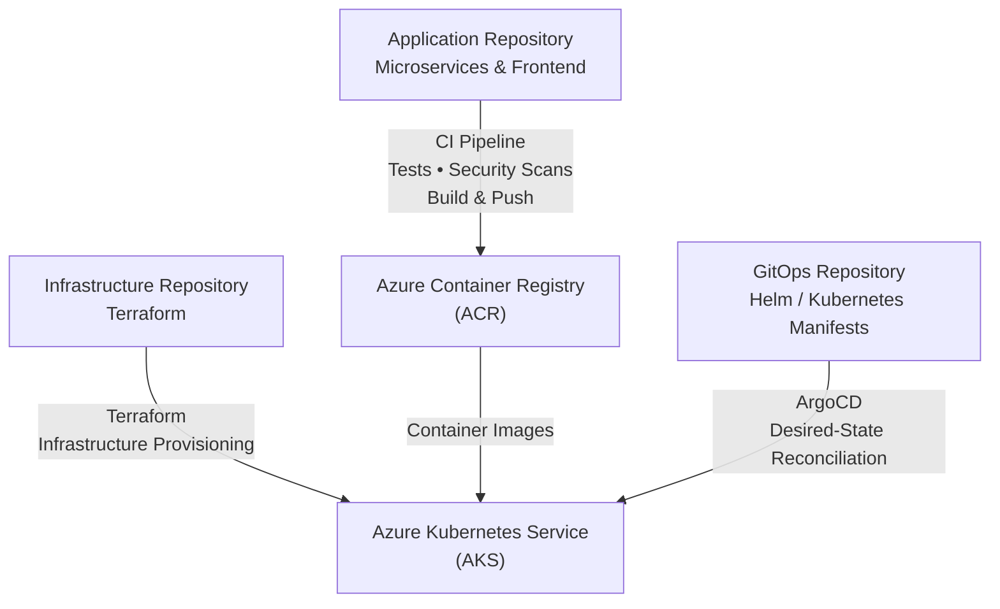

# SignalForge: DevSecOps & Security Engineering Project

SignalForge is a portfolio **DevSecOps platform** built around **containerized microservices, Microsoft Azure, Kubernetes, Terraform, GitHub Actions, and ArgoCD**.

The project brings application delivery, infrastructure provisioning, security controls, and GitOps deployment together through three separate repositories, with each repository responsible for a distinct part of the platform.

### What this project demonstrates

* Containerized microservices
* CI/CD with GitHub Actions
* Infrastructure as Code with Terraform
* Azure Kubernetes Service (AKS)
* Azure Container Registry (ACR)
* GitOps with ArgoCD
* Helm-based Kubernetes deployments
* Container security scanning with Trivy
* OIDC-based GitHub Actions authentication
* Non-root containers and minimal base images
* Application and infrastructure observability
* Cloud cost-aware architecture

---

## 🔗 Project Repositories

SignalForge is organized into three repositories:

| Repository                                                                            | Purpose                                                     |
| ------------------------------------------------------------------------------------- | ----------------------------------------------------------- |
| **[SignalForge](https://github.com/maxiemoses-eu/SignalForge)**                       | Application code, microservices, frontend, Docker and CI/CD |
| **[SignalForge-AzureInfra](https://github.com/maxiemoses-eu/SignalForge-AzureInfra)** | Azure infrastructure managed with Terraform                 |
| **[SignalForge-ArgoCD-2](https://github.com/maxiemoses-eu/SignalForge-ArgoCD-2)**     | Kubernetes, Helm and ArgoCD GitOps configuration            |

**Application → Infrastructure → GitOps**

These repositories are separate by design, but together form one delivery architecture.

---

## 🏗️ Architecture



### Repository responsibilities

**Application — [SignalForge](https://github.com/maxiemoses-eu/SignalForge)**

Contains the frontend, backend microservices, Dockerfiles, application tests, CI/CD workflows, and application-level security controls.

**Infrastructure — [SignalForge-AzureInfra](https://github.com/maxiemoses-eu/SignalForge-AzureInfra)**

Contains the Terraform configuration used to provision and manage the Azure infrastructure supporting the platform.

**GitOps — [SignalForge-ArgoCD-2](https://github.com/maxiemoses-eu/SignalForge-ArgoCD-2)**

Contains the Kubernetes deployment configuration, Helm configuration, and ArgoCD resources used to maintain the desired application state on AKS.

---

# 📊 Engineering Focus

| Engineering Area        | Challenge                                                                  | Approach                                                          |
| ----------------------- | -------------------------------------------------------------------------- | ----------------------------------------------------------------- |
| **CI/CD & Cost**        | Unnecessary workflows can consume additional CI runner time                | Path-based workflow filtering targets builds to relevant changes  |
| **Identity & Access**   | Long-lived cloud credentials increase credential-management risk           | GitHub Actions uses Azure OIDC / Workload Identity Federation     |
| **Container Security**  | Vulnerable images can move further through the delivery pipeline           | Trivy scanning is integrated into the development and CI workflow |
| **Infrastructure**      | Manually provisioned infrastructure is difficult to reproduce consistently | Terraform manages Azure infrastructure as code                    |
| **Deployment**          | Manual Kubernetes deployments can introduce configuration drift            | ArgoCD reconciles the desired state stored in Git                 |
| **Container Hardening** | Excessive privileges and unnecessary packages increase attack surface      | Services use non-root containers and minimal base images          |

Detailed workflow security implementation is documented in:

**[Advanced Workflow Security Documentation](.github/workflows/README.md)**

---

# 🧩 Application Architecture

SignalForge uses multiple services implemented with different technologies to demonstrate a distributed microservices environment.

### Frontend

* React
* Axios
* Jest
* React Testing Library
* nginx
* Hardened nginx configuration

### Backend

| Service     | Language | Framework   |
| ----------- | -------- | ----------- |
| User / Auth | Python   | Flask       |
| Product     | Node.js  | Express     |
| Orders      | Java     | Spring Boot |
| Payments    | Go       | Gin         |

The application repository also contains a gateway service and supporting project components.

Each application service is independently containerized and can be built and tested separately.

---

# 📁 Application Repository Structure

```text
SIGNALFORGE/
├── .github/
│   └── workflows/
├── archived/
├── gateway-microservice/
├── order-microservice/
├── payment-microservice/
├── product-microservice/
├── social-posts/
├── store-ui/
├── templates/
├── user-microservice/
├── .gitignore
├── README.md
└── SECURITY_HARDENING.md
```

### Key components

* `.github/workflows/` — CI/CD and security automation
* `gateway-microservice/` — API gateway
* `order-microservice/` — order processing
* `payment-microservice/` — payment service
* `product-microservice/` — product/catalog functionality
* `user-microservice/` — user and authentication functionality
* `store-ui/` — frontend application
* `security_hardening.md` — security hardening documentation
* `templates/` — reusable project configuration/templates

---

# 🔐 Security & Container Hardening

Security is considered throughout the application and delivery workflow.

### Container-level controls

* Non-root container execution
* Multi-stage Docker builds
* Minimal Alpine / Slim base images
* Pinned dependencies
* Reduced unnecessary OS packages
* Trivy vulnerability scanning
* No hardcoded application credentials

### CI/CD security

GitHub Actions uses **OIDC-based authentication** for Azure rather than relying on long-lived Azure client secrets stored in repository configuration.

This reduces the need for persistent cloud credentials in CI and supports short-lived identity-based authentication.

### Supply-chain security

The delivery workflow incorporates security scanning and artifact validation to identify issues before deployment and reduce the risk of untrusted artifacts reaching the Kubernetes environment.

---

# 📈 Observability & Signal Generation

SignalForge is designed to generate application and operational signals that can support security and observability use cases.

The application can produce signals such as:

* API success/failure events
* Frontend errors
* Checkout failures
* Structured backend logs
* Telemetry events
* Potential abuse-pattern signals

Telemetry is handled through:

* Axios interceptors in the frontend
* Structured backend logging
* `/telemetry` application endpoint

These capabilities provide a foundation for future:

* Detection engineering
* Fraud-analysis exercises
* Incident-response simulations
* Blue-team training
* SOC dashboard development

> **The application is designed to function both as a microservices platform and as a source of security and operational signals.**

---

# 🧪 Testing

### Frontend Tests

From the `store-ui` directory:

```bash
cd store-ui
npm install
npm test
```

### Backend Tests

Each backend service contains its own tests.

Run the relevant test suite from the individual service directory.

---

# 🐳 Building Containers

### Frontend

```bash
docker build -t signalforge-ui ./store-ui
```

### Backend Services

```bash
docker build -t gateway-microservice ./gateway-microservice
docker build -t user-microservice ./user-microservice
docker build -t product-microservice ./product-microservice
docker build -t order-microservice ./order-microservice
docker build -t payment-microservice ./payment-microservice
```

---

# 🔍 Security Scanning

Images can be scanned locally with Trivy.

```bash
trivy image signalforge-ui
trivy image gateway-microservice
trivy image user-microservice
trivy image product-microservice
trivy image order-microservice
trivy image payment-microservice
```

### Container security principles

* Non-root execution
* Minimal base images
* Pinned dependencies
* Reduced OS packages
* Vulnerability scanning
* No unnecessary credentials inside images

---

# ☁️ Azure Infrastructure

The Azure environment is managed separately through Terraform.

**Infrastructure repository:**

**[SignalForge-AzureInfra](https://github.com/maxiemoses-eu/SignalForge-AzureInfra)**

The infrastructure repository covers the Azure resources supporting the platform, including:

* Azure Kubernetes Service
* Azure Container Registry
* Virtual Network and subnets
* Key Vault
* PostgreSQL
* Log Analytics
* Identity and access configuration
* GitHub Actions OIDC integration

Infrastructure decisions, cost considerations, and architectural trade-offs are documented in the IaC repository.

---

# 🔄 GitOps Deployment

Kubernetes deployment configuration is maintained separately from the application and infrastructure repositories.

**GitOps repository:**

**[SignalForge-ArgoCD-2](https://github.com/maxiemoses-eu/SignalForge-ArgoCD-2)**

The repository contains deployment configuration including:

* ArgoCD configuration
* Helm charts
* Helm values
* Kubernetes manifests
* Security configuration

ArgoCD is used to reconcile the desired configuration stored in Git with the application state in Kubernetes.

---

# 🧠 Key Engineering Principles

* **Separation of concerns** — application, infrastructure and deployment configuration are maintained independently
* **Infrastructure as Code** — cloud infrastructure is managed through Terraform
* **GitOps** — Kubernetes desired state is maintained in Git
* **Security by default** — security controls are incorporated throughout the delivery process
* **Least privilege** — authentication and access are designed to minimize unnecessary permissions
* **Observability** — applications should expose useful operational signals
* **Minimal attack surface** — containers avoid unnecessary packages and privileges
* **Cost awareness** — infrastructure decisions consider cloud resource consumption and operating cost

---

# 🛣️ Roadmap

Planned extensions include:

* OpenTelemetry instrumentation
* Admin / SOC dashboard
* Feature flags for incident-response exercises
* WAF-aware application patterns
* Auth-service integration using HttpOnly cookies
* Rate limiting
* Abuse-detection signals
* Expanded security-event visualization

---

# 🔗 Related Repositories

### Application

**[SignalForge](https://github.com/maxiemoses-eu/SignalForge)**

Application code, microservices, frontend, Docker and CI/CD.

### Infrastructure

**[SignalForge-AzureInfra](https://github.com/maxiemoses-eu/SignalForge-AzureInfra)**

Terraform-managed Azure infrastructure.

### GitOps

**[SignalForge-ArgoCD-2](https://github.com/maxiemoses-eu/SignalForge-ArgoCD-2)**

Kubernetes, Helm and ArgoCD deployment configuration.

---

# Project Summary

SignalForge brings together **application development, cloud infrastructure, CI/CD, container security and GitOps** into a single portfolio project.

The project demonstrates how these components work together across the software delivery lifecycle:

**Code → Test → Scan → Build → Registry → Infrastructure → Kubernetes → GitOps → Observability**
