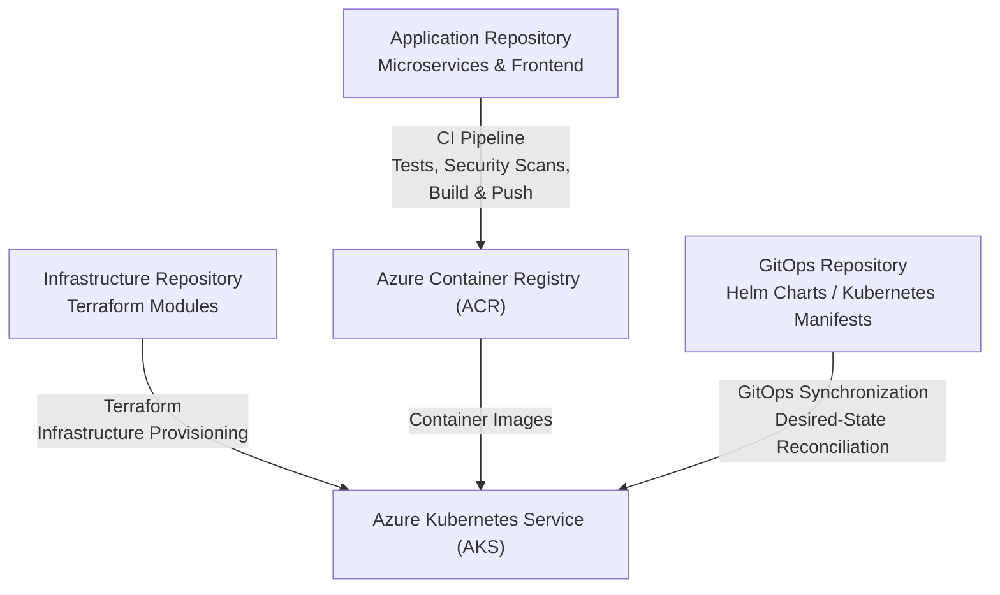

# SignalForge: DevSecOps & Security Engineering Project

SignalForge is a portfolio DevSecOps platform built around **containerized microservices, Microsoft Azure, Kubernetes, Terraform, GitHub Actions, and ArgoCD**.

The project demonstrates how application delivery, infrastructure provisioning, security controls, and GitOps deployment can be separated into three repositories while working together as one platform.

### What this project demonstrates

* Containerized microservices
* CI/CD with GitHub Actions
* Infrastructure as Code with Terraform
* Azure Kubernetes Service (AKS)
* Azure Container Registry (ACR)
* GitOps with ArgoCD
* Helm-based Kubernetes deployments
* Container security scanning with Trivy
* OIDC-based GitHub Actions authentication
* Non-root containers and minimal base images
* Application and infrastructure observability
* Cloud cost-aware architecture decisions

---

## 🔗 Project Repositories

SignalForge is intentionally separated into three repositories:

| Repository                                                                            | Purpose                                                     |
| ------------------------------------------------------------------------------------- | ----------------------------------------------------------- |
| **[SignalForge](https://github.com/maxiemoses-eu/SignalForge)**                       | Application code, microservices, frontend, Docker and CI/CD |
| **[SignalForge-AzureInfra](https://github.com/maxiemoses-eu/SignalForge-AzureInfra)** | Azure infrastructure and Terraform                          |
| **[SignalForge-ArgoCD-2](https://github.com/maxiemoses-eu/SignalForge-ArgoCD-2)**     | Kubernetes, Helm and ArgoCD GitOps configuration            |

**Application → Infrastructure → GitOps**

The three repositories are designed to work together rather than represent three separate projects.

---

## 🏗️ Architecture



### Repository responsibilities

**Application Repository**

Contains the frontend and backend microservices, Dockerfiles, tests, CI workflows, and application-level security controls.

**Infrastructure Repository**

Contains Terraform configuration for the Azure infrastructure supporting the platform.

**GitOps Repository**

Contains the Kubernetes deployment configuration used by ArgoCD to maintain the desired state of the application on AKS.

---

# 📊 Engineering Focus

| Engineering Area        | Challenge                                                                    | Approach                                                          |
| ----------------------- | ---------------------------------------------------------------------------- | ----------------------------------------------------------------- |
| **CI/CD & Cost**        | Unnecessary workflows can consume additional CI runner time                  | Path-based workflow filtering targets builds to relevant changes  |
| **Identity & Access**   | Long-lived cloud credentials increase credential-management risk             | GitHub Actions uses Azure OIDC / Workload Identity Federation     |
| **Container Security**  | Vulnerable images can reach later stages of delivery                         | Trivy scanning is integrated into the development and CI workflow |
| **Infrastructure**      | Manually provisioned cloud resources are difficult to reproduce consistently | Terraform manages Azure infrastructure as code                    |
| **Deployment**          | Manual Kubernetes deployments can create configuration drift                 | ArgoCD continuously reconciles the desired GitOps state           |
| **Container Hardening** | Unnecessary privileges increase container attack surface                     | Services use non-root containers and minimal base images          |

For the detailed workflow security implementation, see:

**[Advanced Workflow Security Documentation](.github/workflows/README.md)**

---

# 🧩 Application Architecture

SignalForge uses multiple services implemented with different technologies to demonstrate a distributed application environment.

### Frontend

* React
* Axios
* Jest
* React Testing Library
* nginx
* Hardened nginx configuration

### Backend

| Service         | Language | Framework   |
| --------------- | -------- | ----------- |
| User / Auth     | Python   | Flask       |
| Product Catalog | Node.js  | Express     |
| Orders          | Java     | Spring Boot |
| Payments        | Go       | Gin         |

Each service is independently containerized and can be built and tested separately.

---

# 🔐 Security & Container Hardening

The project applies security controls at multiple stages of the delivery process.

### Container-level controls

* Non-root containers
* Multi-stage Docker builds
* Minimal Alpine / Slim base images
* Pinned dependencies
* Reduced unnecessary OS packages
* Trivy vulnerability scanning
* No hardcoded application credentials

### CI/CD security

GitHub Actions uses **OIDC-based authentication** for Azure rather than relying on long-lived Azure client secrets stored in repository configuration.

This reduces the need for persistent cloud credentials in CI.

### Supply-chain security

The project incorporates security scanning and artifact validation into the delivery workflow, with the broader architecture designed around reducing the opportunity for untrusted container artifacts to reach the cluster.

---

# 📈 Observability & Signal Generation

SignalForge is also designed as a platform for generating application and operational signals.

The application can produce:

* API success/failure events
* Frontend errors
* Checkout failures
* Structured backend logs
* Telemetry events
* Potential abuse-pattern signals

Telemetry is handled through:

* Axios interceptors in the UI
* Structured backend logging
* `/telemetry` application endpoint

These signals provide a foundation for future:

* Detection engineering
* Fraud-analysis exercises
* Incident-response simulations
* Blue-team training
* SOC dashboard development

> **The application is designed to be both a functional microservices platform and a source of security and operational signals.**

---

# 📁 Project Structure

```text
.
├── ui/
│   ├── src/
│   │   ├── api/
│   │   │   ├── client.js
│   │   │   ├── catalog.js
│   │   │   └── order.js
│   │   ├── components/
│   │   │   ├── ProductList.jsx
│   │   │   └── Notification.jsx
│   │   ├── pages/
│   │   │   └── Shop.jsx
│   │   ├── telemetry/
│   │   │   └── logger.js
│   │   └── App.jsx
│   ├── nginx/
│   │   └── nginx.conf
│   ├── Dockerfile
│   └── README.md
│
├── user-service/
├── catalog-service/
├── order-service/
├── payment-service/
└── README.md
```

---

# 🚀 Getting Started

## Prerequisites

* Docker
* Node.js 20+
* Java 21
* Go 1.22+
* Python 3.11+

---

# 🧪 Testing

### UI Tests

```bash
cd ui
npm install
npm test
```

### Backend Tests

Each backend service contains its own tests.

Run the tests from the individual service directory.

---

# 🐳 Building Containers

### UI

```bash
docker build -t signalforge-ui ./ui
```

### Backend Services

```bash
docker build -t user-service ./user-service
docker build -t catalog-service ./catalog-service
docker build -t order-service ./order-service
docker build -t payment-service ./payment-service
```

---

# 🔍 Security Scanning

Images can be scanned locally with Trivy:

```bash
trivy image signalforge-ui
trivy image user-service
trivy image catalog-service
trivy image order-service
trivy image payment-service
```

### Container security principles

* Non-root execution
* Minimal base images
* Pinned dependencies
* Reduced OS packages
* Vulnerability scanning
* No unnecessary credentials inside images

---

# ☁️ Azure Infrastructure

The Azure environment is managed separately through Terraform.

**Infrastructure repository:**

**[SignalForge-AzureInfra](https://github.com/maxiemoses-eu/SignalForge-AzureInfra)**

The infrastructure repository covers the Azure resources required by the platform, including:

* Azure Kubernetes Service
* Azure Container Registry
* Virtual Network and subnets
* Key Vault
* PostgreSQL
* Log Analytics
* Identity and access configuration
* GitHub Actions OIDC integration

Infrastructure decisions are documented in the IaC repository, including cost considerations and the trade-offs made for a portfolio environment.

---

# 🔄 GitOps Deployment

Kubernetes deployment configuration is maintained separately from the application and infrastructure repositories.

**GitOps repository:**

**[SignalForge-ArgoCD-2](https://github.com/maxiemoses-eu/SignalForge-ArgoCD-2)**

The repository contains the Kubernetes deployment configuration used by the GitOps workflow, including:

* ArgoCD configuration
* Helm charts
* Helm values
* Kubernetes manifests
* Security configuration

ArgoCD is responsible for reconciling the desired configuration stored in Git with the deployed application state in Kubernetes.

---

# 🧠 Key Engineering Principles

* **Separation of concerns** — application, infrastructure and deployment configuration are maintained independently
* **Infrastructure as Code** — cloud infrastructure is reproducible through Terraform
* **GitOps** — Kubernetes desired state is maintained in Git
* **Security by default** — security controls are introduced throughout the delivery process
* **Least privilege** — authentication and access are designed around minimizing unnecessary permissions
* **Observability** — applications should expose useful operational signals
* **Minimal attack surface** — containers avoid unnecessary packages and privileges
* **Cost awareness** — architecture decisions consider the cost of running cloud infrastructure

---

# 🛣️ Roadmap

Planned extensions include:

* OpenTelemetry instrumentation
* Admin / SOC dashboard
* Feature flags for incident-response exercises
* WAF-aware application patterns
* Auth-service integration using HttpOnly cookies
* Rate limiting
* Abuse-detection signals
* Expanded security-event visualization

---

## 🔗 Related Repositories

### Application

**[SignalForge](https://github.com/maxiemoses-eu/SignalForge)**

Application code, microservices, frontend, Docker and CI/CD.

### Infrastructure

**[SignalForge-AzureInfra](https://github.com/maxiemoses-eu/SignalForge-AzureInfra)**

Terraform-managed Azure infrastructure.

### GitOps

**[SignalForge-ArgoCD-2](https://github.com/maxiemoses-eu/SignalForge-ArgoCD-2)**

Kubernetes, Helm and ArgoCD deployment configuration.

---

## Project Summary

SignalForge brings together **application development, cloud infrastructure, CI/CD, container security and GitOps** into a single portfolio project.

The project is structured to demonstrate not only the individual tools, but how they work together across the software delivery lifecycle:

**Code → Test → Scan → Build → Registry → Infrastructure → Kubernetes → GitOps → Observability**
